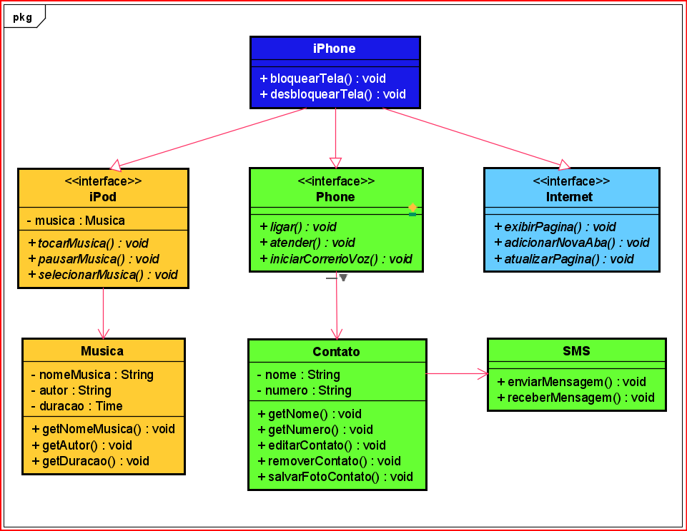
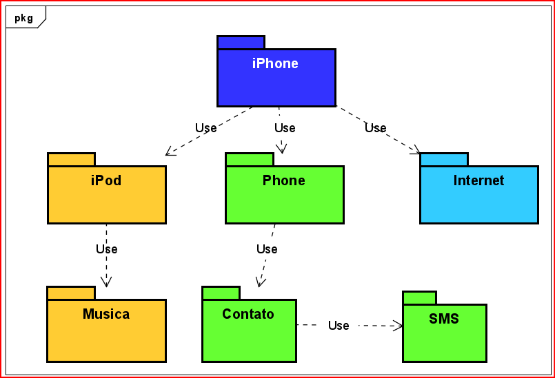

# Desafio

### Bootcamp Desenvolvimento Java com Cloud AWS

## Orientação a Objetos e UML: Diagramação de Classes do iPhone

Modelagem UML, diagramação das classes e interfaces com representação dos papéis do iPhone de: iPod,
Phone e Internet

### Diagramação das interfaces e classes

 

### Diagramação dos pacotes

 

